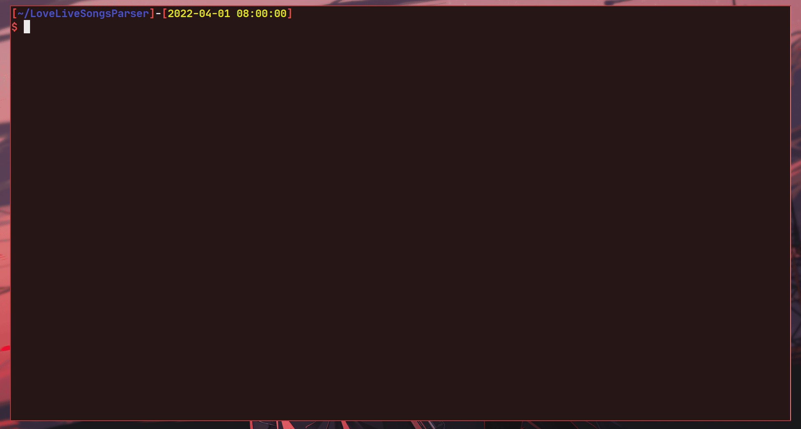

# 🎵 Aesthetics parser of Fandom Wiki


### 🎞 Preview


A Python script that **parses and downloads** aesthetics from
the Fandom Wiki site [**aesthetics.fandom.com**](https://aesthetics.fandom.com/).

## ⚙️ Requirements
  - [**Python 3.7.X or greater**](https://python.org/)
  - [**Beautiful Soup 4**](https://pypi.org/project/beautifulsoup4/)
  - [**aiohttp**](https://pypi.org/project/aiohttp/)

## 💾 Executable binary files (GNU/Linux, Windows)
[**Releases**](https://github.com/Loureas/atlatl1807/aesthetics-parser)

## 📝 Usage
1. Clone the repository:

    ```sh
    git clone https://github.com/atlatl1807/aesthetics-parser
    ```

2. Install required dependencies:

    ```sh
    python -m pip install -U -r requirements.txt
    ```

    > On GNU/Linux, usually the latest version of Python is run with commands such as: `python3`, `python3.7`

3. Run the source code file `lovelive_song_parser.py`:

    ```sh
    python lovelive_song_parser.py
    ```

4. Follow the directions to start downloading.

### What else do you need to know

- When new songs are **released**, **always update** the database to download them
- If you have a **low** Internet speed, it is **not recommended** to raise the number of parallel downloads **above 5**, if the speed is **higher**, then **no higher than 15-20**
- You can specify all or several groups to download

* * *

## 🆘 Issues
If you have any problems while running the script, you can create a new issue on GitHub.

## 🔧 Contribution
You can help improve the script algorithm or translate it. Publish changes in Pull Request.
